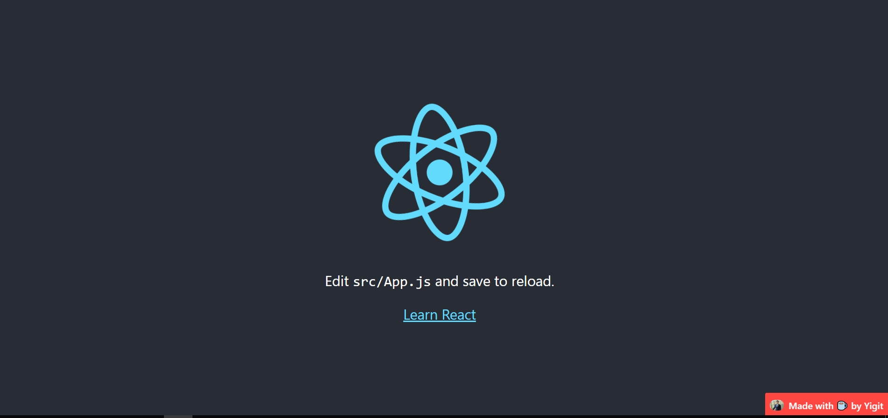

# React-Made-By

[](https://github.com/ya332/react-made-by/blob/master/LICENSE)
[](https://www.npmjs.com/package/react-made-by)
[](https://www.npmjs.com/package/react-made-by)
[](https://travis-ci.org/ya332/react-made-by)
[](https://github.com/prettier/prettier)
<a href="https://codeclimate.com/github/ya332/react-made-by/maintainability"></a>
<a href="https://codeclimate.com/github/ya332/react-made-by/test_coverage"></a>

React-Made-By is a simple component to display author name at the bottom right corner of a page such as this "Made with ☕ by Me" alongside with an image.

### Features

- Displays user's text at the bottom right corner of the page
- Displays image
- Links to a destination url when the component is clicked.

### Why

Because I was looking for an excuse to build a standalone component and publish it in the wild? To be honest, I needed a "created by" component that provided the above features for my [projects](http://ya332.github.io#projects). Since I was unable to find one which met my requirements (and the fact that I generally enjoy re-inventing the wheel) this is what I came up with.

### Demo



Check it out [here](https://stackblitz.com/edit/react-vjhinx?file=src%2FMadeBy.js)

### Installation

The preferred way of using the component is via NPM

```
npm install --save react-made-by
```

make sure you have installed the **peer dependencies** as well with below versions

```
react: ^16.8.0,
react-dom": ^16.8.0

```

It is, however, also available to be used separately (`build/index.js`). This file is hosted [here](https://unpkg.com/react-made-by@0.1.0/build/index.js)

### Usage

Here's a sample implementation that creates the "Made By {NAME}" the component on default Create-React-App page.

```javascript
import React from "react";
import logo from "./logo.svg";
import "./App.css";
import MadeBy from "./components/MadeBy";

function App() {
	return (
		<div className="App">
			<header className="App-header">
				
				<p>
					Edit <code>src/App.js</code> and save to reload.
				</p>
				<a
					className="App-link"
					href="https://reactjs.org"
					target="_blank"
					rel="noopener noreferrer"
				>
					Learn React
				</a>
			</header>
			<MadeBy
				imgSrc="https://ya332.github.io/assets/img/headshot_400x300.jpg"
				destination="https://ya332.github.io"
				text="Made with ☕ by Yigit"
			/>
		</div>
	);
}

export default App;
```

```javascript
const MadeBy = require("react-made-by");
```

If you have ideas to make this component better, [I'd love to hear](https://github.com/ya332/react-made-by/issues/new).

<a name="Options"></a>

### Options

| Option                              | Type     | Default            | Description                                                                    |
| ----------------------------------- | -------- | ------------------ | ------------------------------------------------------------------------------ |
| [`text`](#tagsOption)               | `String` | `Made with lots of ☕!` | Text to be displayed                                                                 |
| [`destination`](#suggestionsOption) | `String` | `""`               | URL string. When clicked on the tag, a new tab with this destination url opens |
| [`imgSrc`](#delimiters)                | `String` | `""`               | src of the image displayed on the component.                                         |

Sample Usage:

```js
<MadeBy
	imgSrc="https://ya332.github.io/assets/img/headshot_400x300.jpg"
	destination="https://ya332.github.io"
	text="Made with ☕ by Yigit"
/>
```

### Styling

It is very easy to customize the look of the component the way you want it. By default, the component `<MadeBy>` provides the following classes with which you can style -

- `MadeBy__a`
- `MadeBy__img`
- `MadeBy__div`
- `MadeBy__p`

If you need to set your own class names on the component, you may pass in
a `classNames` prop.

```js
  <MadeBy
    className={{
    	a: 'aClass',
		img: 'imgClass',
		div: 'divClass',
		p: 'pClass',
    }}
    ...>
```

### Dev

The component is written in ES6 and uses [Webpack](http://webpack.github.io/) as its build tool.

#### Set up instructions

```
git clone git@github.com:ya332/react-made-by.git
cd react-made-by
npm install
npm run start
```

open [http://localhost:3000](http://localhost:3000)

### Contributing

Got ideas on how to make this better? Open an issue [here!](https://github.com/ya332/react-made-by/issues/new)

Also thanks to the awesome contributors who've made the library far better!

[default-suggestions-filter-logic]: https://github.com/ya332/react-made-by/blob/v4.0.1/lib/MadeBy.js#L83
[includes-polyfill]: https://github.com/mathiasbynens/String.prototype.includes
