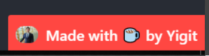

[](https://github.com/ya332/react-made-by/blob/master/LICENSE)
[](https://www.npmjs.com/package/react-made-by)
[](https://www.npmjs.com/package/react-made-by)
[](https://travis-ci.org/ya332/react-made-by)
[](https://github.com/prettier/prettier)
[](https://github.com/ya332/react-made-by/blob/master/CONTRIBUTING.md)
<a href="https://codeclimate.com/github/ya332/react-made-by/maintainability"></a>

<a href="https://www.buymeacoffee.com/ya332" target="_blank"></a>

# React-Made-By

React-Made-By is a simple component to display author name at the bottom right corner of a page such as this "Made with ☕ by Me" alongside with an image.



### Features

- Displays user's text at the bottom right corner (it defaults to right but can be changed to be left ) of the page
- Displays image
- Links to a destination url when the component is clicked.

### Why

Because I was looking for an excuse to build a standalone component and publish it in the wild? To be honest, I needed a "created by" component that provided the above features for my [projects](http://ya332.github.io#projects). Since I was unable to find one which met my requirements (and the fact that I generally enjoy re-inventing the wheel) this is what I came up with.

### Demo


Check it out [here](https://stackblitz.com/edit/react-made-by?file=App.js)

### Installation

The preferred way of using the component is via NPM

```
npm install --save react-made-by
```

make sure you have installed the **peer dependencies** as well with below versions

```
react: ^16.8.0,
react-dom": ^16.8.0

```

It is, however, also available to be used separately (`build/index.js`). This file is hosted [here](https://unpkg.com/react-made-by@0.1.0/build/index.js)

### Usage

Here's a sample implementation that creates the "Made By {NAME}" the component on default Create-React-App page.

```javascript
import React from "react";
import logo from "./logo.svg";
import "./App.css";
import MadeBy from "react-made-by";

function App() {
	return (
		<div className="App">
			<header className="App-header">
				
				<p>
					Edit <code>src/App.js</code> and save to reload.
				</p>
				<a
					className="App-link"
					href="https://reactjs.org"
					target="_blank"
					rel="noopener noreferrer"
				>
					Learn React
				</a>
			</header>
			<MadeBy
				imgsrc="https://ya332.github.io/assets/img/headshot_400x300.jpg"
				destination="https://ya332.github.io"
				text="Made with ☕ by Yigit"
				imgfirst={true}
				position="left"
				style={{zIndex:'1'}}

			/>
		</div>
	);
}

export default App;
```

```javascript
const MadeBy = require("react-made-by");
```

If you have ideas to make this component better, [I'd love to hear](https://github.com/ya332/react-made-by/issues/new).

<a name="Options"></a>

### Options

| Option                              | Type     | Default            | Description                                                                    |
| ----------------------------------- | -------- | ------------------ | ------------------------------------------------------------------------------ |
| [`text`](#tagsOption)               | `String` | `Made with lots of ☕!` | Text to be displayed                                                                 |
| [`destination`](#suggestionsOption) | `String` | `""`               | URL string. When clicked on the tag, a new tab with this destination url opens |
| [`imgsrc`](#delimiters)                | `String` | `""`               | src of the image displayed on the component.                                         |
| [`position`](#delimiters)                | `String` | `"right"`               | Location of the tag on the screen. Potential values are 'left' and 'right' |
| [`imgfirst`](#delimiters)                | `Boolean` | `true`               | When set to true, the component displays img and then p element. When set to false, it displays the p and then img element. Potential values are true and false |
| [`style`](#delimiters)                | `JSON Object` | `DefaultMadeByStyles (for more info check the source code)`               | You can pass any CSS field via style, and it will override. For example, style={{marginTop:'34234px'}} |

Sample Usage:

```js
<MadeBy
	imgsrc="https://ya332.github.io/assets/img/headshot_400x300.jpg"
	destination="https://ya332.github.io"
	text="Made with ☕ by Yigit"
	imgfirst={true}
	position="left"
	style={{zIndex:'1'}}
/>
```

### Styling

It is very easy to customize the look of the component the way you want it. If you need to set your own class names on the component, you may pass css attributes via style field.


```js
...
  <MadeBy
  	...
    style={{
		zIndex: '1231',
		paddingEnd:'43px',
		marginTop:'231231px'
	}}
	...
...
```

### Dev

The component is written in ES6 and uses [Webpack](http://webpack.github.io/) as its build tool.

#### Set up instructions
Easiest way is to go to [here](https://stackblitz.com/edit/react-vjhinx?file=src%2FMadeBy.js) and start playing with it.

You can add the `example/src/MadeBy.js` file to your project as a component, or you can link a test `create-react-app` project to `react-made-by` library. To do the link, follow these steps:
Given that you are at `/app/` and `react-made-by` is at this directory `/app/react-made-by`:
```bash
npx create-react-app test-react-made-by
cd test-react-made-by
npm install
npm link
cd ../react-made-by
npm link test-react-made-by
```
If you get Invalid Hooks Warning, check this (link)[https://reactjs.org/warnings/invalid-hook-call-warning.html] and do `npm link ../test-react-made-by/node_modules/react` from `/app/react-made-by`


Doing the following will watch the files, but not run a webpack-dev-server on a browser, so you can't see your changes. 
```
git clone git@github.com:ya332/react-made-by.git
cd react-made-by
npm install
npm run start
```
open [http://localhost:3000/build](http://localhost:3000/build)

### Contributing

Got ideas on how to make this better? Open an issue [here!](https://github.com/ya332/react-made-by/issues/new)

Also thanks to the awesome contributors who've made the library far better!

[default-suggestions-filter-logic]: https://github.com/ya332/react-made-by/blob/v4.0.1/lib/MadeBy.js#L83
[includes-polyfill]: https://github.com/mathiasbynens/String.prototype.includes
